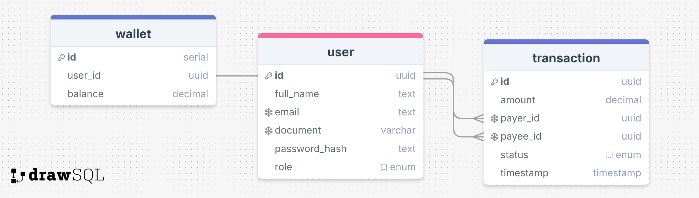

<p align="center">
  <a href="https://nestjs.com/" target="blank"></a>
</p>

<p align="center">A <strong>modular</strong> and <strong>scalable</strong> API for financial <strong>transactions</strong> and transaction <strong>statistics</strong>.</p>

## Overview

A Payment and Transaction API that supports customer-to-customer (C2C) and customer-to-merchant (C2M) financial operations. It adheres to RESTful principles, a modular design, and a scalable architecture.

## Table of Contents

- [Features](#features)
- [System Requirements](#system-requirements)
- [How to Run](#how-to-run)
- [API Endpoints](#api-endpoints)
- [Architecture](#architecture)
- [Data Model](#data-model)
- [Error Handling](#error-handling)
- [Observability and Logging](#observability-and-logging)
- [Design Patterns and Best Practices](#design-patterns-and-best-practices)
- [Performance and Scalability](#performance-and-scalability)

## Features

### Functional Requirements

- **Authentication & Authorization**
  - Role-based Access Control (RBAC).
- **User Management**
  - Users can be customers or merchants.
  - Users have a wallet.
  - Users must provide a full name, CPF/CNPJ (unique), email (unique), and password.
- **Transactions**
  - Customers can deposit funds into their wallet.
  - Customers can transfer funds to other users (customers or merchants).
  - Merchants can only receive transfers.
  - Transactions must have a positive amount (> 0).
  - Statistics available for transaction history.

### Business Rules

- Merchants cannot perform outgoing transfers.
- Sender's balance must be verified before a transfer.
- Transactions must call an external authorization service:
  [GET https://util.devi.tools/api/v2/authorize](https://util.devi.tools/api/v2/authorize).
- All transfers must be atomic and reversible in case of failure.
- Notifications sent to both parties using:
  [POST https://util.devi.tools/api/v1/notify](https://util.devi.tools/api/v1/notify).
  - If the notification service is unavailable, the notification should be added to a processing queue for later retry.

### Non-functional Requirements

- Containerization with Docker.
- Observability with health checks.
- Logging for all operations.
- Modularized architecture adhering to SOLID principles.
- PostgreSQL as the main database.
- MongoDB for logging.
- Redis for caching.
- CI/CD pipelines for seamless integration and deployment.
- Passwords stored using bcrypt hashing.
- HTTPS enforced in production using NGINX.

## System Requirements

- **Node.js** >= +20
- **Docker** >= latest
- **Docker Compose** >= latest

## How to Run

### Step 1: Clone the Repository

```bash
git clone https://github.com/patricks-js/simplified-payment-api.git
cd simplified-payment-api
```

### Step 2: Setup Environment Variables

Copy `.env.example` to `.env` and configure the necessary variables.

```bash
cp .env.example .env
```

### Step 3: Build and Run the Docker Containers

```bash
docker-compose up --build
```

### Step 4: Access the Application

The application will be available at `http://localhost:3000`.

## API Endpoints

### 1. Transaction Endpoints

#### Deposit Funds

```http request
POST /deposit
Content-Type: application/json

{
  "amount": "100.00"
}
```

Response:

- **201 Created**: Transaction validated and accepted.
- **422 Unprocessable Entity**: Transaction not processed (e.g., amount ≤ 0).
- **400 Bad Request**: Validation errors (e.g., invalid payload, missing fields).
- **500 Internal Server Error**: Unexpected server-side errors.

#### Perform a Transfer

```http request
POST /transfer
Content-Type: application/json

{
  "amount": "100.00",
  "payer": 4,
  "payee": 15
}
```

Response:

- **201 Created**: Transaction validated and accepted.
- **422 Unprocessable Entity**: Transaction not processed (e.g., amount ≤ 0, insufficient balance, or merchant trying to transfer).
- **400 Bad Request**: Validation errors (e.g., invalid payload, missing fields).
- **500 Internal Server Error**: Unexpected server-side errors.
- **503 Service Unavailable**: External authorization or notification service is unavailable.
  - Notifications will be queued for later processing if the notification service is unavailable.

#### Get Transaction Statistics

```http request
GET /statistics
Content-Type: application/json

{
  "count": 10,
  "sum": 1234.56,
  "avg": 123.456,
  "min": 12.34,
  "max": 123.56
}
```

- **200 OK**: Returns statistics of transactions in the last 60 seconds.
  - If no transactions are found, all fields (`count`, `sum`, `avg`, `min`, `max`) will return `0`.
- **500 Internal Server Error**: Unexpected server-side errors.

### 2. Health Check

```http request
GET /health
```

- **200 OK**: Application is healthy.
- **503 Service Unavailable**: Application is experiencing issues.

## Architecture

The system is designed with a modular and scalable architecture:

- **Modules**: Divided into user management, transactions, notifications, and statistics.
- **Design Patterns**: Factory, Repository, and Dependency Injection.
- **Layers**: Controller, Service, Repository, and Model.
- **Database**:
  - **PostgreSQL** for user and wallet data.
  - **MongoDB** for logging operations.
  - **Redis** for caching frequently accessed data and transaction statistics.

## ER Diagram (Entity-Relationship)

The following diagram represents the database structure used in this project:



## Observability and Logging

- **Health Checks**: `/health` endpoint.
- **Structured Logs**: Include timestamps, log levels, and correlation IDs, stored in **MongoDB**.
- **Metrics**: Track performance (e.g., response time, throughput).

## Design Patterns and Best Practices

- **Factory Pattern**: For creating reusable components.
- **Repository Pattern**: For abstracting database interactions.
- **Dependency Injection**: For flexible and testable components.
- **SOLID Principles**: Applied throughout to ensure maintainability.

## CI/CD

The repository includes a GitHub Actions workflow for:

1. Running tests and static code analysis.
2. Building and pushing Docker images.
3. Deploying to staging/production environments.
